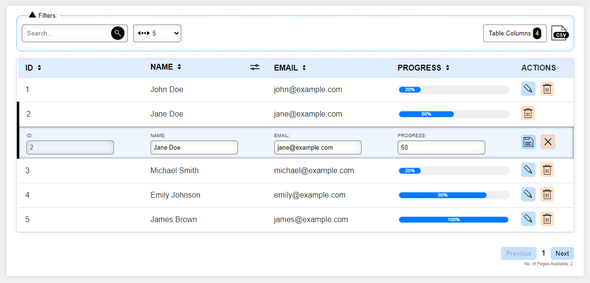

# angular-datatable-sm
Dynamic Datatable SM generation based on your requirement with values passed
<br/>

<table>
  <tr>
    <td align="center">
      
    </td>
   </tr>
</table>

## Installation

```sh
npm i angular-datatable-sm
```

## Usage

## Import
### Step 1:
```ts
import { AngularDatatableSmModule } from 'angular-datatable-sm';

@NgModule({
  ...
  imports: [
    ...
    AngularDatatableSmModule
  ],
  ...
})
```

### Step 2:
Create a service file - "table-data.service" - #Referrence_Path#
& import it inside component where you want to use our "angular-datatable-sm" package:
```ts
import { TableDataService } from './services/tableData/table-data.service';

constructor(public tableDataService: TableDataService) { }
```

## Fundamental Usage
### Step 3:
Add in same component html file, where you have imported "TableDataService":

```html
<lib-angular-datatable-sm
  [pagination]="true"
  [itemsPerPage]="5"
  [tableDataService]="tableDataService">
</lib-angular-datatable-sm>
```

## Fundamentals

| Property/Method  |  Type   |  Default  | Description                                                                            |
| ---------------- | :-----: | :-------: | -------------------------------------------------------------------------------------- |
| pagination       | boolean |   false   | Parent flag to showcase pagination for data table                                      |
| itemsPerPage     | number  |     10    | Mandatory field with "pagination" to show number of items per page                     |
| tableDataService | service |     -     | Service file having api calling methods & return observale which can subscribe further |


# Configuration - JSON/Object
Values with dummy data is added below, to recieve as required response/structure:
Service file methods must return below format as response, to pass.

```ts
let tableData = {
    headers: [
      { id: 1, name: 'id', checked: true },
      { id: 2, name: 'name', checked: true },
      { id: 3, name: 'age', checked: false },
      { id: 4, name: 'email', checked: true },
      { id: 4, name: 'progress', checked: true },
      { id: 4, name: 'emp_number', checked: false },
      { id: 4, name: 'ratings', checked: false },
    ],
    entries: [
      { id: 1, name: 'John Doe', age: 30, email: 'john@example.com', progress: 10, emp_number: '245', ratings: 4.5 },
      { id: 2, name: 'Jane Doe', age: 28, email: 'jane@example.com', progress: 50, emp_number: '246', ratings: 4 },
      { id: 3, name: 'Michael Smith', age: 35, email: 'michael@example.com', progress: 20, emp_number: '247', ratings: 1.5 },
      { id: 4, name: 'Emily Johnson', age: 25, email: 'emily@example.com', progress: 80, emp_number: '248', ratings: 2.25 },
      { id: 5, name: 'James Brown', age: 32, email: 'james@example.com', progress: 97, emp_number: '249', ratings: 3.58 },
      { id: 6, name: 'John Doe', age: 30, email: 'john@example.com', progress: 53, emp_number: '250', ratings: 3.50 },
      { id: 7, name: 'Jane Doe', age: 28, email: 'jane@example.com', progress: 91, emp_number: '251', ratings: 4 },
      { id: 8, name: 'Michael Smith', age: 35, email: 'michael@example.com', progress: 63, emp_number: '252', ratings: 4.5 },
      { id: 9, name: 'Emily Johnson', age: 25, email: 'emily@example.com', progress: 25, emp_number: '253', ratings: 4.85 },
      { id: 10, name: 'James Brown', age: 32, email: 'james@example.com', progress: 13, emp_number: '254', ratings: 5 }
    ],
    permissions: {
      searchVisibility: true,
      exportToCsvVisibility: true,
      filterTableHeadersVisibility: true,
      filterBtnTableContentVisibility: true,
      showcaseActionButtons: ['edit', 'delete']
    },
    dependentKeys: {
      progressColumn: 'progress',
      progressBarType: 'bar',
      ratingsColumn: 'ratings',
      filterColumn: 'name',
      maxRating: 5,
      editSaveActionButtonBgColor: '#007bff3b',
      deleteActionButtonBgColor: '#ff73003b',
      closeActionButtonBgColor: '#ff73003b'
    },
    extras: {
      uncheckAllStatus: false,
      dropdownButtonText: 'Table Columns',
      filterBoxArrowStatus: true
    }
  };
```

or you can try it with json file importing in service file as well: #JSON_PATH

## Author
You can contact me via. mail for any modiciations/updations for this package.
<br/>
Suraj Motwani - Email: suraj.motwani1306@gmail.com

## License

Dynamic Datatable SM is available under the MIT license. See the LICENSE file for more info.

